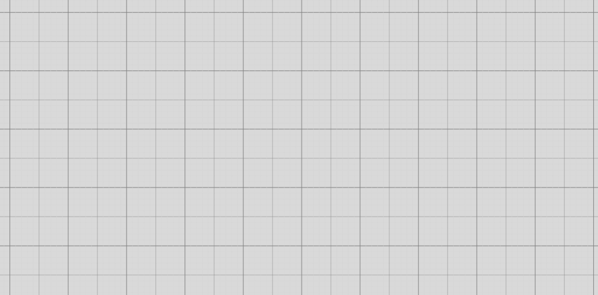
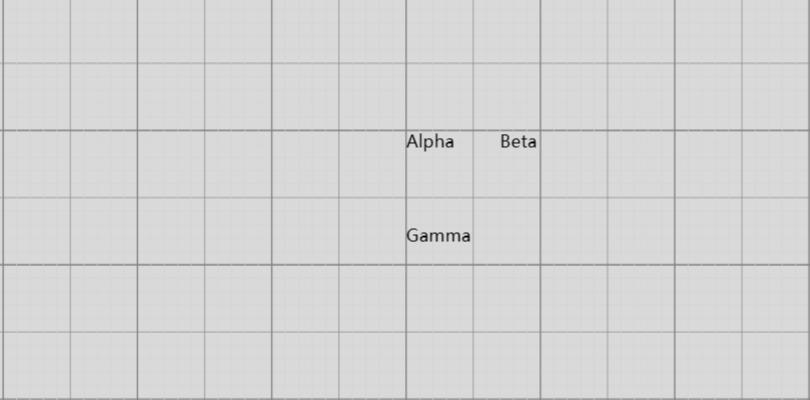
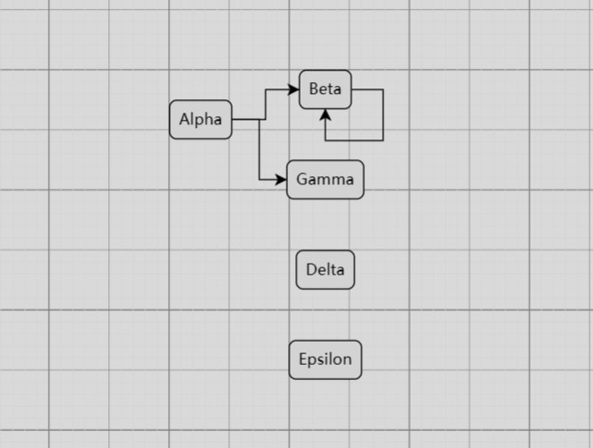

GoJS是一款强大的JavaScript图表库，用于创建交互式和可定制的图表、图形和流程图。它提供了丰富的功能和灵活的API，使开发人员能够轻松地构建各种类型的图表应用。

# 一，创建画布

GoJS中的画布（Canvas）是一个可视化容器，用于呈现和管理图表中的图形元素。它是GoJS图表的主要组成部分之一，提供了一个可交互的绘图区域。

以下是GoJS画布的一些基本概念和功能：

1. 绘图区域：画布提供一个可见的绘图区域，用于显示图表中的图形元素。您可以设置画布的大小、背景色和边界等属性。
2. 图形元素：在画布上可以放置和管理各种图形元素，如节点、连接线、标签等。这些图形元素可以通过拖放、编程方式或用户交互来创建、编辑和删除。
3. 坐标系统：画布使用坐标系统来定位和放置图形元素。坐标系统通常是二维的，使用x和y坐标来表示元素在画布上的位置。
4. 缩放和平移：画布提供了缩放和平移功能，使用户能够放大、缩小和移动整个图表。这对于处理大型图表和导航图表非常有用。
5. 事件处理：画布可以捕获和处理各种交互事件，如点击、拖动、缩放等。您可以通过监听这些事件来实现自定义的交互逻辑。
6. 布局和自动排列：GoJS提供了多种布局算法，可用于自动排列和调整图表中的图形元素。这些布局算法可以根据您的需求自动调整节点的位置和连接线的布局。
7. 导航和视口管理：画布支持导航和视口管理功能，使用户能够浏览和导航大型图表。您可以设置画布的滚动条、缩略图和焦点等属性。

首先来创建一个画布：

```vue
<template>
  <!--1，定义一个挂载点，用于绑定画布  -->
  <div id="myDiagramDiv"></div>
</template>

<script setup>
import {onMounted, reactive, toRefs, ref} from 'vue'

const state = reactive({})

const {} = toRefs(state)


/***************************** diagram 初始化 ******************************/
function init() {
  /**
   * 2，将画布绑定到页面元素
   */
  let $ = go.GraphObject.make;
  let myDiagram = $(go.Diagram, "myDiagramDiv");

  /*********************************** 画布属性配置 ***********************************/
  // 1，显示网格
  myDiagram.grid.visible = true;
  // 2，拖动时对齐网格
  myDiagram.toolManager.draggingTool.isGridSnapEnabled = true;
  // 3，置大小时对齐网格
  myDiagram.toolManager.resizingTool.isGridSnapEnabled = true;
}


onMounted(() => {
  init()
});
</script>

<style scoped>

#myDiagramDiv {
  /* 居中 */
  margin: 0 auto;
  /* 宽度 */
  width: 100%;
  /* 高度 */
  height: 80vh;
}
</style>
```

现在画布是空的：



# 二，创建视图与模型

GoJS 有一个模型-视图架构：

- 模型：保存描述节点和链接的数据。
- 视图：使用实际的 Node 和 Link 对象组合成具体的图形来可视化模型数据。

## （一）添加节点模型

在[ `myDiagram.model.nodeDataArray` ](https://gojs.net.cn/api/symbols/Model.html#nodeDataArray)中添加节点模型：

```javascript
function init() {
  let $ = go.GraphObject.make;
  let myDiagram = $(go.Diagram, "myDiagramDiv");

  // 1，创建一个简单的模型
  let myModel = $(go.Model);

  // 2，在模型中定义一些节点模型数据
  myModel.nodeDataArray = [
    {key: "Alpha"},
    {key: "Beta"},
    {key: "Gamma"}
  ];
  myDiagram.model = myModel;

  /*********************************** 画布属性配置 ***********************************/
  // 1，显示网格
  myDiagram.grid.visible = true;
  // 2，拖动时对齐网格
  myDiagram.toolManager.draggingTool.isGridSnapEnabled = true;
  // 3，置大小时对齐网格
  myDiagram.toolManager.resizingTool.isGridSnapEnabled = true;
}
```

- **myModel.nodeDataArray 中每个对象的属性名可以是任何名称。**

现在图中有三个节点：



## （二）在视图中显示更多的节点样式

我们还可通过创建由 GraphObject 组成的模板并在这些对象上设置属性的方式来设置节点的样式。

为了创建一个完善的节点，我们可以使用一下几个构建工具：
● [Shape](https://gojs.net.cn/intro/shapes.html)——设置带有颜色的预定义或自定义几何图形
● [TextBlock](https://gojs.net.cn/intro/textblocks.html)——设置节点中各种字体的（可能可编辑的）文本
● [Picture](https://gojs.net.cn/intro/pictures.html)——为节点添加图片
● [Panel](https://gojs.net.cn/intro/panels.html)——用于容纳其他对象集合的容器。其中的对象可以根据面板的类型以不同的方式进行定位和调整大小

所有这些构建工具都派生自 GraphObject 抽象类，因此我们随意将它们称为 GraphObjects 或对象或元素。请注意，GraphObject 不是 HTML DOM 元素，因此创建或修改此类对象的开销并不大。

这种通过数据属性来影响节点外观和行为的操作就是**数据绑定**。
● 所有这些构建工具都派生自 GraphObject 抽象类，因此我们随意将它们称为 GraphObjects 或对象或元素。请注意，GraphObject 不是 HTML DOM 元素，因此创建或修改此类对象的开销并不大。

怎样用这些构建工具呢？就是将它们定义在[ myDiagram.model.nodeTemplate](https://gojs.net.cn/api/symbols/Diagram.html#nodeTemplate) 模型中。

### 1，TextBlock

```javascript
function init() {
  let $ = go.GraphObject.make;
  let myDiagram = $(go.Diagram, "myDiagramDiv");

  // 创建一个简单的模型
  let myModel = $(go.Model);

  // 在模型中定义一些节点模型数据
  myModel.nodeDataArray = [
    {name: "Alpha", nickname: "Al"},
    {name: "Beta", nickname: "Bee"},
    {name: "Gamma", nickname: "Gam"},
  ];

  myDiagram.model = myModel;

  myDiagram.nodeTemplate =
      $(go.Node,
          $(go.TextBlock,
              // 将 TextBlock.text 绑定到 Node.data.nickname
              new go.Binding("text", "nickname"))
      );

  /*********************************** 画布属性配置 ***********************************/
  // 1，显示网格
  myDiagram.grid.visible = true;
  // 2，拖动时对齐网格
  myDiagram.toolManager.draggingTool.isGridSnapEnabled = true;
  // 3，置大小时对齐网格
  myDiagram.toolManager.resizingTool.isGridSnapEnabled = true;
}
```

效果如下：


通常我们会在绑定数据后，进一步指定构建工具的具体属性：

效果如下：


常用的 TextBlock 配置：

* [textAlign](https://gojs.net.cn/api/symbols/TextBlock.html#textAlign)："left"</span></em><span class="ne-text"> | </span><em><span class="ne-text">"right"</span></em><span class="ne-text"> | </span><em><span class="ne-text">"start"</span></em><span class="ne-text"> | </span><em><span class="ne-text">"end"</span></em><span class="ne-text"> | </span><em><span class="ne-text">"center"</span></em>`，指定文字布局位置
* [editable](https://gojs.net.cn/api/symbols/TextBlock.html#editable)："boolean" 指定文字是否可编辑

> 更多 [TextBlock](https://gojs.net.cn/api/symbols/TextBlock.html) 配置

### 2，Shape

```vue
function init() {
  let $ = go.GraphObject.make;
  let myDiagram = $(go.Diagram, "myDiagramDiv");

  // 创建一个简单的模型
  let myModel = $(go.Model);

  // 在模型中定义一些节点模型数据
  myModel.nodeDataArray = [
    {name: "Alpha", nickname: "Al"},
    {name: "Beta", nickname: "Bee"},
    {name: "Gamma", nickname: "Gam"},
  ];

  myDiagram.model = myModel;

  myDiagram.nodeTemplate =
      $(go.Node,
          // 形状
          $(go.Shape,
              // 指定 Shape 的形状
              "RoundedRectangle",
              // 继续指定 Shape 的其他属性
              {
                width: 60,                      // 宽度
                height: 40,                     // 高度
                stroke: "black",                // 颜色
                strokeWidth: 1,                 // 线宽
                fill: "lightblue",              // 填充色
                margin: 10,                     // 间距
              }
          )
      );

  /*********************************** 画布属性配置 ***********************************/
  // 1，显示网格
  myDiagram.grid.visible = true;
  // 2，拖动时对齐网格
  myDiagram.toolManager.draggingTool.isGridSnapEnabled = true;
  // 3，置大小时对齐网格
  myDiagram.toolManager.resizingTool.isGridSnapEnabled = true;
}
```

效果如下：


更多 [Shape](https://gojs.net.cn/api/symbols/Shape.html) 配置

### 3，Picture

```javascript
function init() {
  let $ = go.GraphObject.make;
  let myDiagram = $(go.Diagram, "myDiagramDiv");

  // 创建一个简单的模型
  let myModel = $(go.Model);

  // 在模型中定义一些节点模型数据
  myModel.nodeDataArray = [
    {name: "Alpha", nickname: "Al"},
    {name: "Beta", nickname: "Bee"},
    {name: "Gamma", nickname: "Gam"},
  ];

  myDiagram.model = myModel;

  myDiagram.nodeTemplate =
      $(go.Node,
          // 图片
          $(go.Picture,
              {
                source: "/static/img/favicon.ico",  // 图片路径
                width: 30,                          // 宽度
                height: 30,                         // 高度
                margin: 2,                          // 间距
                background: "lightblue",            // 背景色
                flip: go.GraphObject.FlipVertical,  // 垂直翻转
              }
          ),
      );

  /*********************************** 画布属性配置 ***********************************/
  // 1，显示网格
  myDiagram.grid.visible = true;
  // 2，拖动时对齐网格
  myDiagram.toolManager.draggingTool.isGridSnapEnabled = true;
  // 3，置大小时对齐网格
  myDiagram.toolManager.resizingTool.isGridSnapEnabled = true;
}
```


SVG图片必须指定大小，否则有些浏览器不会显示：

```javascript
$(go.Picture,
    {
      source: "/static/img/logo.svg",  // 图片路径
      width: 30,                          // 宽度
      height: 30,                         // 高度
      // // 期望大小
      // desiredSize: new go.Size(580, 580)
    }
),
```

一个例子：

```vue
<template>
  <div id="myDiagramDiv"></div>
</template>

<script setup>
import {onMounted, reactive, toRefs, ref} from 'vue'

const state = reactive({})

const {} = toRefs(state)


/***************************** diagram 初始化 ******************************/
function init() {
  let $ = go.GraphObject.make;
  let myDiagram = $(go.Diagram, "myDiagramDiv");

  // 节点模板配置
  myDiagram.nodeTemplate =
      $(go.Node,
          "Horizontal",
          {background: "#44CCFF"},
          $(go.Picture,
              // 在图片不可见时，图片的大小
              {margin: 10, width: 50, height: 50, background: "red"},
              // Picture.source 绑定到 Node.data.source
              new go.Binding("source")
          ),
          $(go.TextBlock,
              // 使用默认值
              "Default Text",
              {margin: 12, stroke: "white", font: "bold 16px sans-serif"},
              // TextBlock.text 绑定到 Node.data.name
              new go.Binding("text", "name"))
      );

  let model = $(go.Model);
  // 节点模型数据
  model.nodeDataArray =
      [
        {name: "Don Meow", source: "/images/learn/cat1.png"},
        {name: "Copricat", source: "/images/learn/cat2.png"},
        {name: "Demeter", source: "/images/learn/cat3.png"},
        { /* Empty node data */}
      ];
  myDiagram.model = model;

  /*********************************** 画布属性配置 ***********************************/
  // 1，显示网格
  myDiagram.grid.visible = true;
  // 2，拖动时对齐网格
  myDiagram.toolManager.draggingTool.isGridSnapEnabled = true;
  // 3，置大小时对齐网格
  myDiagram.toolManager.resizingTool.isGridSnapEnabled = true;
}


onMounted(() => {
  init()
});
</script>

<style scoped>

#myDiagramDiv {
  /* 居中 */
  margin: 0 auto;
  /* 宽度 */
  width: 100%;
  /* 高度 */
  height: 80vh;
}
</style>
```


### 4，Panel

在GoJS中，Panel是一个容器元素，用于在图表或节点中组织和布局其他元素。它提供了一种灵活的方式来排列和定位其子元素，使您能够创建复杂且可定制的布局。

以下是与GoJS中Panel相关的一些关键概念：

1. 元素容器：Panel作为其他图形元素（如形状、文本块、图像或其他Panel）的容器。它允许您将这些元素组合和组织在一起。
2. 布局选项：Panel提供了各种布局选项来定位和排列其子元素。您可以使用预定义的布局，如GridLayout、TableLayout，或自定义布局来定义元素的定位行为。
3. 大小和对齐：Panel可以控制其子元素的大小和对齐方式。您可以指定元素的大小，使其可以填充可用空间或保持其自然大小。此外，您还可以在Panel内对元素进行对齐，如顶部、底部、左侧、右侧或居中。
4. 嵌套和层次结构：Panel可以相互嵌套，以创建层次结构布局。这使您可以在元素内部创建复杂的布局，实现高级图表结构。
5. 响应式设计：GoJS中的Panel支持响应式设计，可以根据可用空间的变化进行调整。您可以定义规则，根据可用空间或屏幕大小修改元素的布局和大小。
6. 自定义和样式：Panel可以使用各种属性和设置进行自定义和样式化。您可以修改Panel的外观、背景、边框和其他视觉方面，以匹配应用程序的设计。

**Panel是在GoJS中创建有组织和结构化图表的基本概念。它提供了一种强大的方式来排列和管理图形元素，提供了对图表的布局和呈现的灵活性和控制能力。**

面板类型：

* [Panel.Position](https://gojs.net.cn/api/symbols/Panel.html#static-Position)
* [Panel.Vertical](https://gojs.net.cn/api/symbols/Panel.html#static-Vertical)
* [Panel.Horizontal](https://gojs.net.cn/api/symbols/Panel.html#static-Horizontal)
* [Panel.Auto](https://gojs.net.cn/api/symbols/Panel.html#static-Auto)
* [Panel.Spot](https://gojs.net.cn/api/symbols/Panel.html#static-Spot)
* [Panel.Table](https://gojs.net.cn/api/symbols/Panel.html#static-Table) **(see the next section about** [Table Panels](https://gojs.net.cn/intro/tablePanels.html))
* [Panel.Viewbox](https://gojs.net.cn/api/symbols/Panel.html#static-Viewbox)
* [Panel.Link](https://gojs.net.cn/api/symbols/Panel.html#static-Link) **(see the section about** [Link Labels](https://gojs.net.cn/intro/linkLabels.html))
* [Panel.Grid](https://gojs.net.cn/api/symbols/Panel.html#static-Grid) **(see the section about** [Grid Patterns](https://gojs.net.cn/intro/grids.html))
* [Panel.Graduated](https://gojs.net.cn/api/symbols/Panel.html#static-Graduated) (see the section about [Graduated Panels](https://gojs.net.cn/intro/graduatedPanels.html))

我们一般就通过在 Panel 中装入我们需要的 Pamel 类型来自定义我们需要的面板：


```javascript
function init() {
  let $ = go.GraphObject.make;
  let myDiagram = $(go.Diagram, "myDiagramDiv");

  // 节点模板配置
  myDiagram.nodeTemplate =
    $(go.Node,
      "Auto",
      $(go.Shape,
        "Rectangle",
        {
          // 边框颜色
          stroke: "black",
          // 边框宽度
          strokeWidth: 1,
          // 填充色
          fill: "white",
          // 宽度
          width: 200,
        }
       ),
      // 自定义面板
      $(go.Panel,
        "Vertical",
        // 头部
        $(go.Panel,
          "Auto",
          $(go.TextBlock,
            {
              margin: 5,
              stroke: "black",
              font: "bold 16px sans-serif",
            },
            new go.Binding("text", "name")
           )
         ),
        // 内容
        $(go.Panel,
          "Auto",
          $(go.Shape,
            "Rectangle",
            {
              fill: "white",
              stroke: null,
              width:199
            },
            new go.Binding("fill", "color")
           ),
          $(go.TextBlock,
            "Default Text",
            {
              margin: 10,
              stroke: "black",
              font: "bold 14px sans-serif",
              textAlign: "left",
              // 指定文本可用的宽度
              width: 199,
              // 文本自动换行
              wrap: go.TextBlock.WrapDesiredSize,
            },
            new go.Binding("text", "content")
           )
         ),
        // 底部
        $(go.Panel,
          "Auto",
          $(go.TextBlock,
            "Default Text",
            {font: "bold 16px sans-serif"},
            new go.Binding("text", "country")
           )
         )
       )
     );

  let model = $(go.Model);
  // 节点模型数据
  model.nodeDataArray =
    [
      {
        name: "Alpha",
        content: "Alpha is the first letter of the Greek alphabet.1111111111111111111111111111",
        country: "Greek",
        color: "lightblue"
      },
      {name: "B", content: "In English, B is the second letter.", country: "English", color: "pink"},
      {name: "三", content: "三是第一个质数。", country: "Chinese", color: "lightgreen"}
    ];
  myDiagram.model = model;

  /*********************************** 画布属性配置 ***********************************/
  // 1，显示网格
  myDiagram.grid.visible = true;
  // 2，拖动时对齐网格
  myDiagram.toolManager.draggingTool.isGridSnapEnabled = true;
  // 3，置大小时对齐网格
  myDiagram.toolManager.resizingTool.isGridSnapEnabled = true;
}
```


## （三）添加链接模型与模板

要将链接模型渲染出来，需要 go.GraphLinksModel 来组合链接与节点，再设置到 myDiagram.model 来实现视图展示：

```vue
<template>
  <div id="myDiagramDiv"></div>
</template>

<script setup>
import {onMounted, reactive, toRefs, ref} from 'vue'

const state = reactive({})

const {} = toRefs(state)


/***************************** diagram 初始化 ******************************/
function init() {
  let $ = go.GraphObject.make;
  let myDiagram = $(go.Diagram, "myDiagramDiv");

  // 节点模板
  myDiagram.nodeTemplate =
      $(go.Node, "Auto",
          new go.Binding("location", "loc", go.Point.parse),
          $(go.Shape, "RoundedRectangle", {fill: "lightgray"}),
          $(go.TextBlock, {margin: 5},
              new go.Binding("text", "key"))
      );
  // 链接模板
  myDiagram.linkTemplate =
      $(go.Link,
          $(go.Shape)
      );

  // 节点模型
  let nodeDataArray = [
    {key: "Alpha", loc: "0 0"},
    {key: "Beta", loc: "100 50"}
  ];
  // 链接模型
  let linkDataArray = [
    {from: "Alpha", to: "Beta"}
  ];

  // 定义模型
  myDiagram.model = new go.GraphLinksModel(nodeDataArray, linkDataArray);

  /*********************************** 画布属性配置 ***********************************/
  // 1，显示网格
  myDiagram.grid.visible = true;
  // 2，拖动时对齐网格
  myDiagram.toolManager.draggingTool.isGridSnapEnabled = true;
  // 3，置大小时对齐网格
  myDiagram.toolManager.resizingTool.isGridSnapEnabled = true;
}

onMounted(() => {
  init()
});
</script>

<style scoped>

#myDiagramDiv {
  /* 居中 */
  margin: 0 auto;
  /* 宽度 */
  width: 100%;
  /* 高度 */
  height: 80vh;
}
</style>
```


链接模型 linkDataArray 中最重要的字段就是 `from` 和 `to`，分别指定了链接的出口节点与入口节点，我们可以在模板定义中添加箭头来更好地表示这种关系：

```javascript
// 链接模板
myDiagram.linkTemplate =
  $(go.Link,
    // 链接的形状
    $(go.Shape,
      {stroke: "black", strokeWidth: 2}
     ),
    // 链接的箭头
    $(go.Shape,
      {toArrow: "OpenTriangle", stroke: "blue", strokeWidth: 2}
     )
   );
```


链接的样式与定义方式也有多种方式，具体[看这里](https://gojs.net.cn/intro/links.html#Arrowheads)。

# 三，画布布局

gojs 支持五种布局方式：

* [GridLayout](https://gojs.net.cn/api/symbols/GridLayout.html) —— 网格布局
* [TreeLayout](https://gojs.net.cn/api/symbols/TreeLayout.html) —— 树形布局
* [ForceDirectedLayout](https://gojs.net.cn/api/symbols/ForceDirectedLayout.html) —— 力导向布局
* [LayeredDigraphLayout](https://gojs.net.cn/api/symbols/LayeredDigraphLayout.html) —— 分层有向图布局
* [CircularLayout](https://gojs.net.cn/api/symbols/CircularLayout.html) —— 圆形布局

```javascript
  // 设置
  myDiagram.layout = new go.LayeredDigraphLayout();
```



# 四，简单事件
## 1，图形对象单击事件


## 2，图形对象右键事件


# 五，gojs 去水印

```JavaScript
1，打开 node_modules/gojs/release/go-module.js 文件。
2，node_modules/gojs/release 下有多个 js 文件，可分别在这些文件顶部添加 console.log 语句。
3，删除 node_modules/.vite 目录，删除旧文件。
4，npm run dev 重新启动项目，去产生新文件。
5，node_modules/.vite/goja.js 查看具体使用的是 node_modules/gojs/release 下的哪个 js 文件，
6，确定后进入 node_modules/gojs/release 下对应文件，搜索 document.createElement("canvas") ，找到下面这个地方：
    function ni() {
        if (Ng) {
            var a = x.document.createElement("canvas"), b = a.getContext("2d"), c = Ma("7ca11abfd022028846");
            b[c] = Ma("398c3597c01238");
            for (var d = ["5da73c80a36455d7038e4972187c3cae51fd22", ra.Dx + "4ae6247590da4bb21c324ba3a84e385776", ld.xF + "fb236cdfda5de14c134ba1a95a2d4c7cc6f93c1387", K.za], e = 1; 5 > e; e++) b[Ma("7ca11abfd7330390")](Ma(d[e - 1]), 10, 15 * e);
            b[c] = Ma("39f046ebb36e4b");
            for (c = 1; 5 > c; c++) b[Ma("7ca11abfd7330390")](Ma(d[c - 1]), 10, 15 * c);
            if (4 !== d.length || "5" !== d[0][0] || "7" !== d[3][0]) ld.prototype.Cd = ld.prototype.Cu;
            aj = a
        }
    }
7，修改最后一行：
    function ni() {
        if (Ng) {
            var a = x.document.createElement("canvas"), b = a.getContext("2d"), c = Ma("7ca11abfd022028846");
            b[c] = Ma("398c3597c01238");
            for (var d = ["5da73c80a36455d7038e4972187c3cae51fd22", ra.Dx + "4ae6247590da4bb21c324ba3a84e385776", ld.xF + "fb236cdfda5de14c134ba1a95a2d4c7cc6f93c1387", K.za], e = 1; 5 > e; e++) b[Ma("7ca11abfd7330390")](Ma(d[e - 1]), 10, 15 * e);
            b[c] = Ma("39f046ebb36e4b");
            for (c = 1; 5 > c; c++) b[Ma("7ca11abfd7330390")](Ma(d[c - 1]), 10, 15 * c);
            if (4 !== d.length || "5" !== d[0][0] || "7" !== d[3][0]) ld.prototype.Cd = ld.prototype.Cu;
            // aj = a
            aj = x.document.createElement("canvas");
        }
    }
8，vite build --mode 打包项目
9，另存修改后的 node_modules/gojs 以备后用
```

到此，基础概念介绍完毕！

## （一）

## （二）

## （三）

## （四）

## （五）

## （六）

## （七）

## （八）

## （九）

## （十）

## （十一）

### 1，

### 2，

### 3，

### 4，

### 5，

### 6，

### 7，

### 8，

#### （1）

#### （2）

#### （3）

#### （4）

#### （5）

#### （6）

#### （7）

#### （8）
