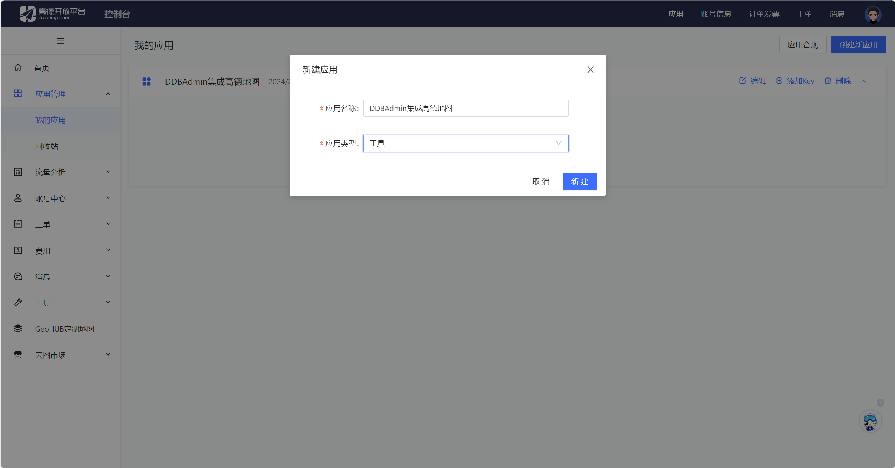
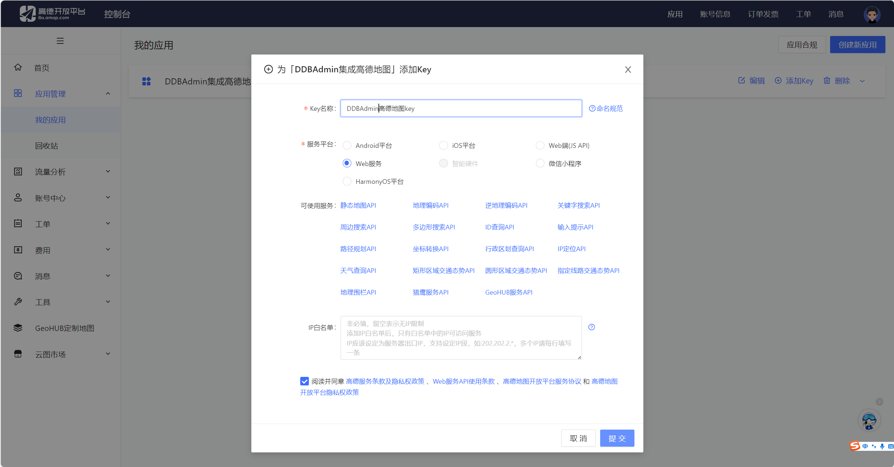
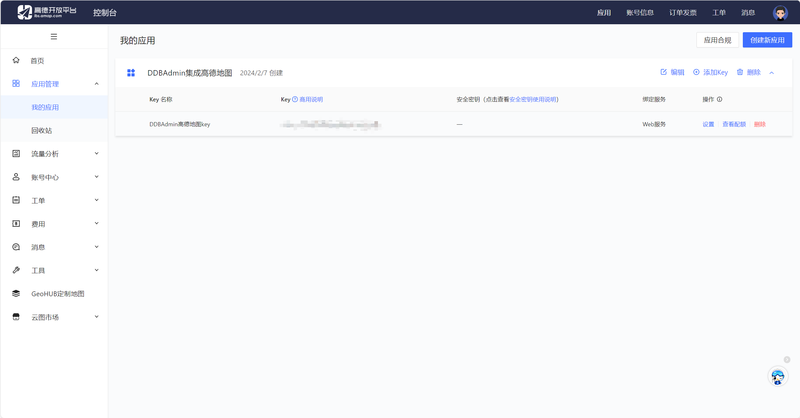

# 一，注册高德开发者

按照官方教程来：[成为开发者并创建 key](https://lbs.amap.com/api/javascript-api-v2/prerequisites)

# 二，在 vue3 中集成高德地图
还是按照官方教程来：[JS API 结合Vue使用](https://lbs.amap.com/api/javascript-api-v2/guide/abc/amap-vue)

