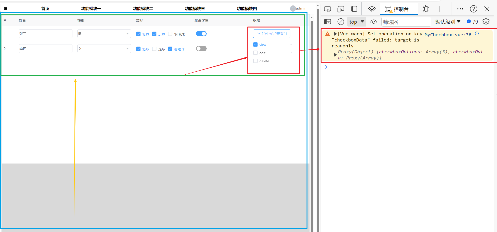

# 问题

现状如下：


在孙组件 MyChechbox.vue 中，勾选了一个复选框，控制台报警告。
这是因为孙组件 MyChechbox.vue 中的 checkboxData 是从父组件 MyChechbox.vue 中通过 props 传递过来的——props 的特点就是只要父组件中的 checkboxData 发生变化，孙组件中的 checkboxData 也会发生一致的变化。
当我们在孙组件中修改了这个双向绑定到 checkboxData 的数据时，就会导致父组件中的数据也发生变化。
而根据 Vue3 的**单向数据流原则：子组件不能修改父组件 props 过来的数据**，不然应用的数据流将很容易变得混乱而难以理解，所以会报这个警告。

这里我们确实需要在孙组件中修改父组件传递过来的数据，那么我们该怎么做呢？

# 解决方案
在 vue3 官网提供了两种场景及其解决方案。

1，prop 被用于传入初始值；而子组件想在之后将其作为一个局部数据属性。
也就是说，props 充当了一个初始值，而之后我们会在子组件中修改这个值，在这种情况下，最好是新定义一个局部数据属性，从 props 上获取初始值即可：
```JavaScript
const props = defineProps(['initialCounter'])

// 计数器只是将 props.initialCounter 作为初始值
// 像下面这样做就使 prop 和后续更新无关了
const counter = ref(props.initialCounter)
```


