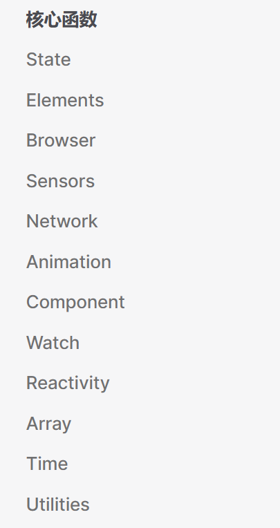

# 一，前言

关于**组合式函数——hooks**可以参考前面的内容。

# 二，介绍
vueuse是一个基于vue3的组合式函数库，它提供了一系列的组合式函数，可以帮助我们更方便的开发vue3的项目。

在前面的内容中，我们已经介绍了vue3的组合式函数，一个典型的组合式函数的定义与使用如下：
```javascript
// mouse.js
import { ref, onMounted, onUnmounted } from 'vue'

// 按照惯例，组合式函数名以“use”开头
export function useMousePositionDisplay() {
  // 被组合式函数封装和管理的状态
  const x = ref(0)
  const y = ref(0)

  // 组合式函数可以随时更改其状态。
  function update(event) {
    x.value = event.pageX
    y.value = event.pageY
  }

  // 一个组合式函数也可以挂靠在所属组件的生命周期上
  // 来启动和卸载副作用
  onMounted(() => window.addEventListener('mousemove', update))
  onUnmounted(() => window.removeEventListener('mousemove', update))

  // 通过返回值暴露所管理的状态
  return { x, y }
}
```
```vue
<template>
  <el-card>
    <p>多组件中复用鼠标追踪器</p>
    <p>当前鼠标位置：({{ x }}, {{ y }})</p>
  </el-card>
</template>

<script setup>
import {useMousePositionDisplay} from '@/hooks/mouse.js'

const {x, y} = useMousePositionDisplay()
</script>

<style scoped>

</style>
```

vueuse直接提供了一个组合式函数`useMouse`，它的功能与上面的`useMousePositionDisplay`一致，开箱即用：
```vue
<template>
  <el-card>
    <p>当前鼠标位置：({{ x }}, {{ y }})</p>
  </el-card>
</template>

<script setup>
import {useMouse} from '@vueuse/core'

const {x, y} = useMouse()
</script>
```

前提是只需要执行` npm i @vueuse/core `安装vueuse库即可。

这个 hooks 除了这么用之外，vueuse 还提供其组件式用法：
```vue
<UseMouse v-slot="{ x, y }">
  x: {{ x }}
  y: {{ y }}
</UseMouse>
```

# 三，使用示例
[vueuse ](https://www.vueusejs.com/)提供的组合式函数更加强大：


1，延时重复调用
使用[ `useInterval` ](https://www.vueusejs.com/shared/useInterval/#useinterval)可以实现延时重复调用：
```vue
<template>
  <div id="APP">
    <p>Interval fired: {{ counter }}</p>
    <button @click="pause">Pause</button>
    <button @click="resume">Resume</button>
  </div>
</template>

<script setup lang="ts">
import {useInterval} from '@vueuse/core'


const {counter, pause, resume} = useInterval(1000, {controls: true})

</script>
```

2，获取窗口尺寸
使用[ `useWindowSize` ](https://www.vueusejs.com/shared/useWindowSize/#usewindowsize)来实现获取窗口尺寸：

```vue
<template>
  <el-card>
    <p>窗口尺寸: {{ width }} x {{ height }}</p>
  </el-card>
</template>

<script setup lang="ts">
import {
  useWindowSize,
} from '@vueuse/core'

const {width, height} = useWindowSize()
</script>
```

3，可以暂停的 watch
使用[ `watchPausable` ](https://www.vueusejs.com/shared/watchPausable/#watchpausable) 来实现可以暂停的 watch：
```vue
<template>
  <el-card>
    <p class="mb-2">输入一些内容以触发watch</p>
    <el-input
        ref="input"
        v-model="source"
        type="text"
    />

    <el-button :disabled="!isActive" class="orange" @click="pauseW">
      Pause
    </el-button>
    <el-button :disabled="isActive" @click="resumeW">
      Resume
    </el-button>
    <el-button @click="clearW">
      Clear Log
    </el-button>

    <br>
    <br>

    <p>Log</p>

    <pre>{{ log }}</pre>
  </el-card>
</template>

<script setup lang="ts">
import {ref} from 'vue'
import {
  onStartTyping,
  watchPausable
} from '@vueuse/core'

const input = ref<HTMLInputElement | null>()
const log = ref('')

const source = ref('')

const watcher = watchPausable(
    source,
    v => (log.value += `Changed to "${v}"\n`),
)

onStartTyping(() => input.value?.focus())

function clearW() {
  log.value = ''
}

function pauseW() {
  log.value += 'Paused\n'
  watcher.pause()
}

function resumeW() {
  log.value += 'Resumed\n'
  watcher.resume()
}

const {isActive} = watcher
</script>
```


